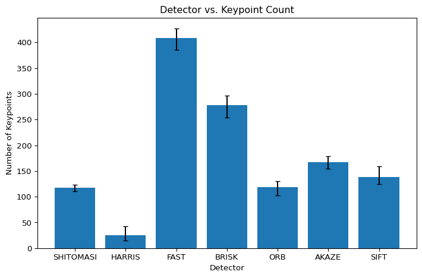
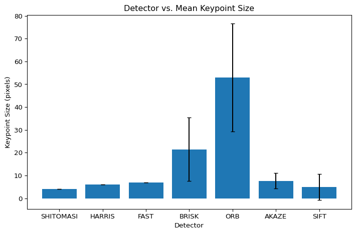
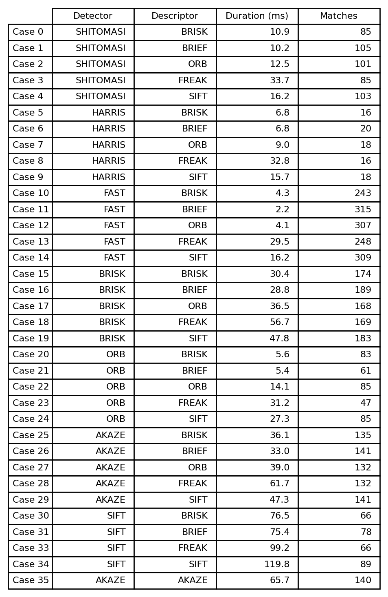
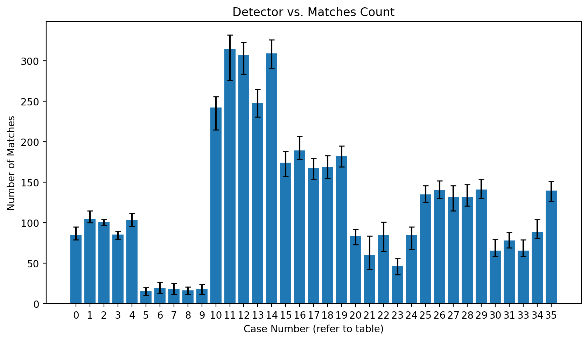
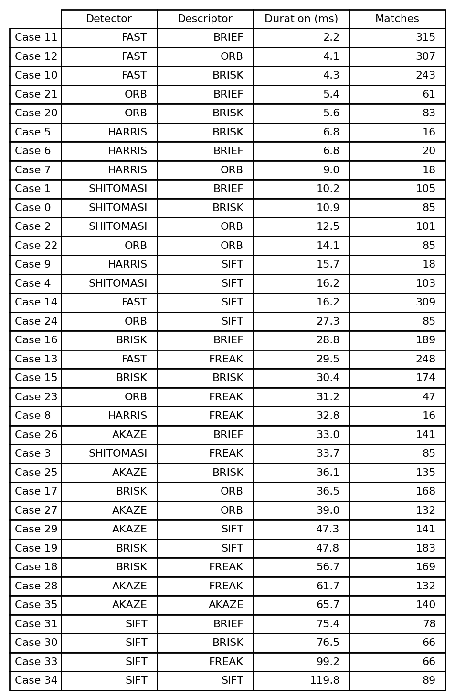
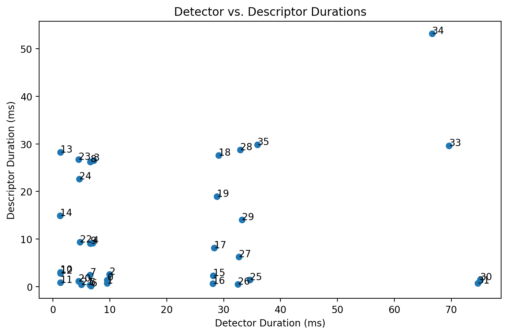
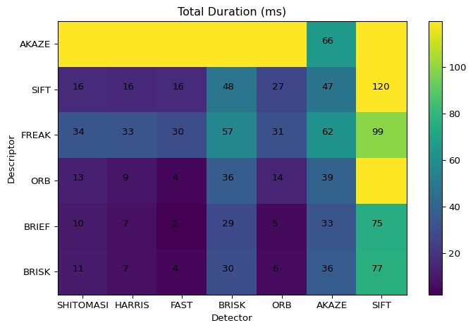

# Data Analysis for 2D Feature Extraction

Thirty five different 2D feature extraction test cases were performed on the sample sequence of images with data written to a CSV file for further analysis. The output plots can be generated with new data produced by running `2D_feature_tracking` and following the instructions in the last section of this report.

## Feature Extraction Performance Evaluation

### MP.7 Number of Keypoints Extracted

The mean number of keypoints per image extracted by each detector are shown in the following Fgiure:



The error bars represent the minimum and maximum number of points for a single image processed by the detector. The **FAST** detector found the greatest number of keypoints and **HARRIS** the fewest. The keypoint mean size is presented in the following figure:



The error bars on the mean size plot depict one standard deviation from the mean for each detector based on all keypoints extracted from the sample image sequence. The **ORB** detector showed the size and largest distribution of sizes compared to all other detectors. The **SHITOMASI**,  **HARRIS**, and **FAST** detectors have zero standard deviation since their size is fixed and their sizes were kept constant for all test cases. The **SIFT** keypoints showed a large distribution of sizes compared to the mean. **BRISK** detector keypoints were mid-sized.

### MP.8 Number of Matches

The mean number of matches and computation time for each detector-descriptor test case are shown in the following table:



The number of matches are visualized in the following plot with each test case corresponding the above table:



The error bars on the matches plot depict the maximum and minimum matches in an image comparison.

### MP.9 Computation Time

The detector and descriptor operations were timed. The mean total duration in milliseconds for each test case are sorted in the following table:



The **FAST** detector and **BRIEF** descriptor were fastest and the **SIFT** detector and descriptor were slowest. Generally, the **FAST**, **ORB**, and **HARRIS** detectors with **BRIEF**, **ORB**, and **BRISK** descriptors performed well. The test cases and durations are also visualized in the following two figures:





The detector vs descriptor plot shows the average computation time in milliseconds for each tested combination. The results generally show classic detectors performing well, SIFT being slow, and BRISK and AKAZE in between. The AKAZE descriptor only functions with the associated AKAZE detector and teh SIFT-ORB detectror/descriptor combination threw a memory exception.

Based on the smallest computation time, the top 3 recommended detector/descriptor cases are:

| Case | Detector | Descriptor |
|------|----------|------------|
|11    |**FAST**  |**BRIEF**   |
|12    |**FAST**  |**ORB**     |
|10    |**FAST**  |**BRISK**   |

The number of matches are high compared to other descriptors so there may be more false positive than more robust but slower descriptors. Without ground truth data, we cannot make strong claims on the accuracy of the feature detection techniques for this analysis, only that they are computationally efficient.

## How to Generate Plots From Csv

Create virtual environment and install prerequisites

```bash
python3 -m venv .venv
source ./.venv/bin/activate
python -m pip install numpy matplotlib
```

In file [process2DfeatureData.py](process2DfeatureData.py), modify the following lines to use a different csv file and affect other output parameters:

```python
# input data
data_file = 'analysis/data/output_2020-04-07_09h04m54s.csv'

# show plots
display_plots = True

# output plot size
plot_size = {
    'width': 7.5,
    'height': 5,
    'dpi': 96
}

# table output size
table_size = {
    'width': 6,
    'height': 9,
    'dpi': 96
}
```

Then run script:

```bash
python ./analysis/process2DfeatureData.py
```
