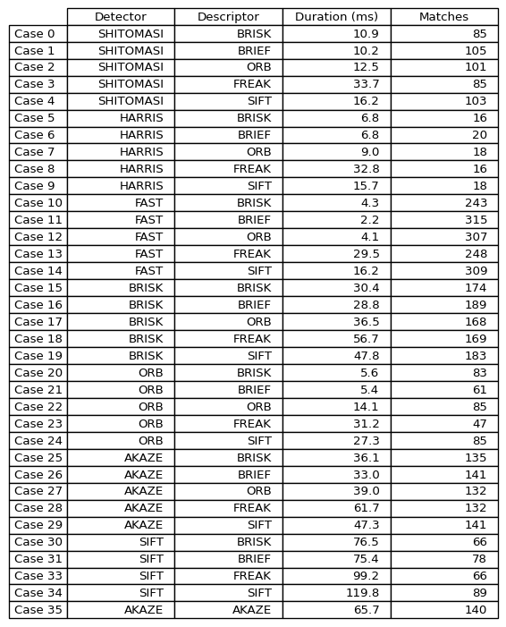
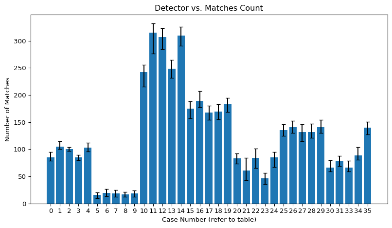
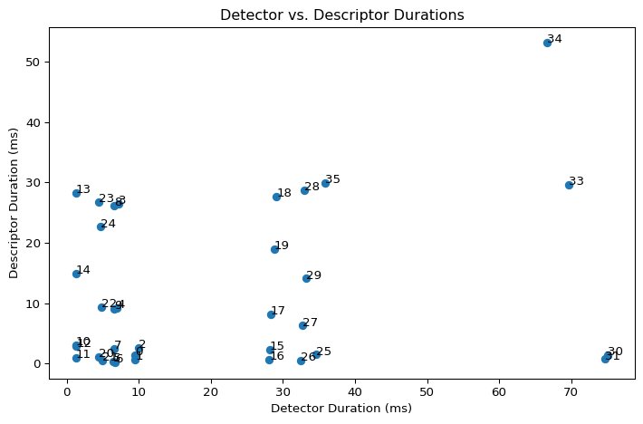

# Data Analysis for 2D Feature Extraction

## Data Plots










## How to Generate Plots From Csv

Create virtual environment and install prerequisites

```bash
python3 -m venv .venv
source ./.venv/bin/activate
python -m pip install numpy matplotlib
```

In file [process2DfeatureData.py](process2DfeatureData.py), modify the following lines to use a different csv file and affect other output parameters:

```python
# input data
data_file = 'analysis/data/output_2020-04-07_09h04m54s.csv'

# show plots
display_plots = True

# output plot size
plot_size = {
    'width': 7.5,
    'height': 5,
    'dpi': 200
}

# table output size
table_size = {
    'width': 5,
    'height': 9,
    'dpi': 200
}
```

Then run script:

```bash
python ./analysis/process2DfeatureData.py
```
